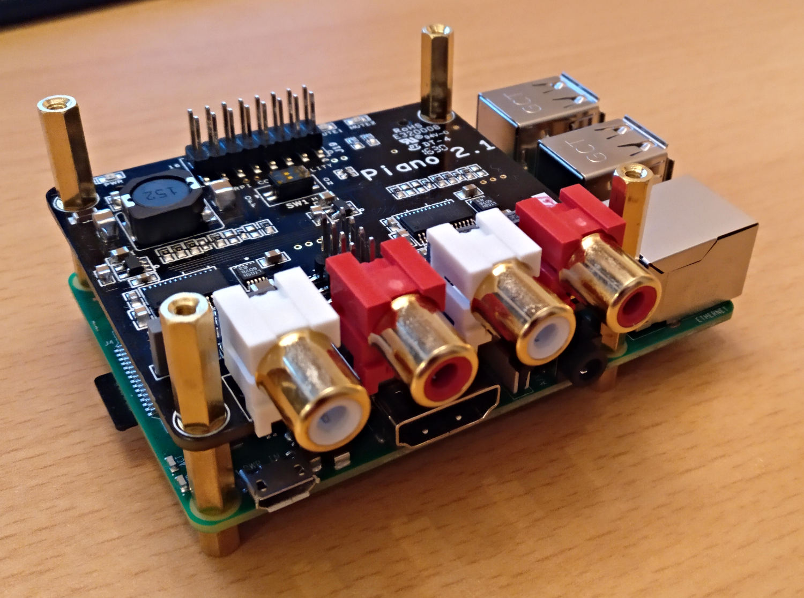
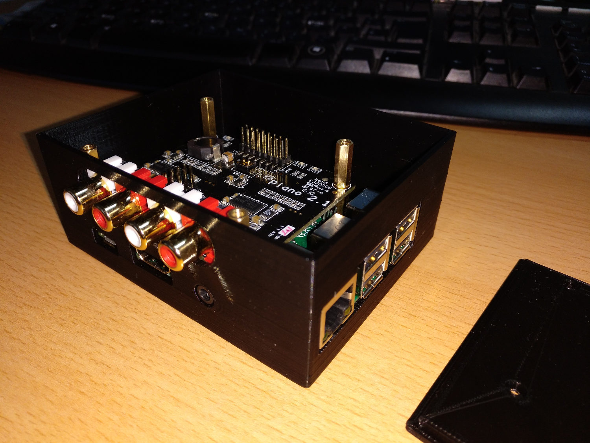
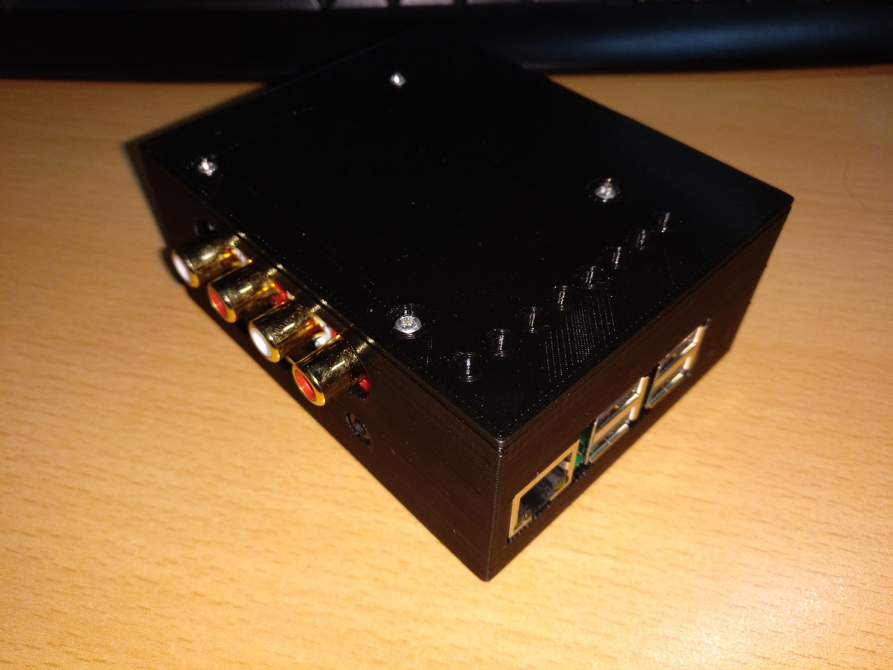

# Case for Raspberry Pi 3B+ and Allo Piano DAC FreeCAD model

This is a Raspberry Pi 3B+ with a Allo Piano DAC case.
The Pi gets mounted with hex brass standoffs.
3D-print-it!!

## STL downloads

**Case**

**Cap**

**Complete**

**Pi & Piano**

**Pi & Piano in the Case**

Note: The case of **Rev001** in the images does not fit properlly.

-----------
**Front**

**Right**

**Bottom**

**Mounting Holes**

# LICENSE

<dl>
 Dieses Werk ist lizenziert unter einer <a rel="license" href="http://creativecommons.org/licenses/by/4.0/">Creative Commons Namensnennung 4.0 International Lizenz</a>.
</dl>

<dl>
 This work is licensed under a <a rel="license" href="http://creativecommons.org/licenses/by/4.0/">Creative Commons Attribution 4.0 International License</a>.
</dl>
