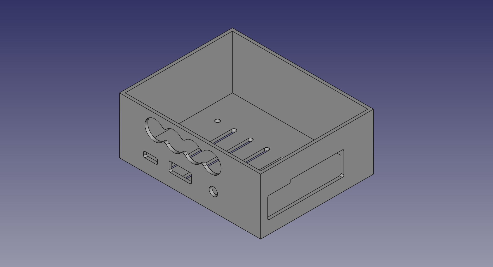
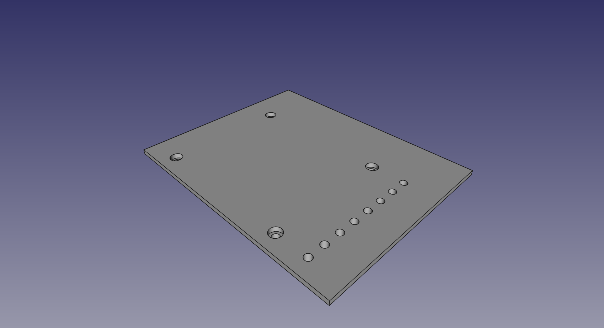
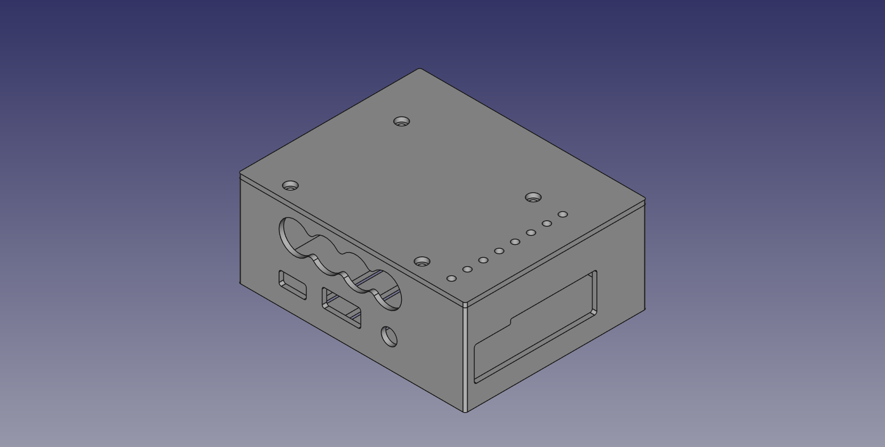
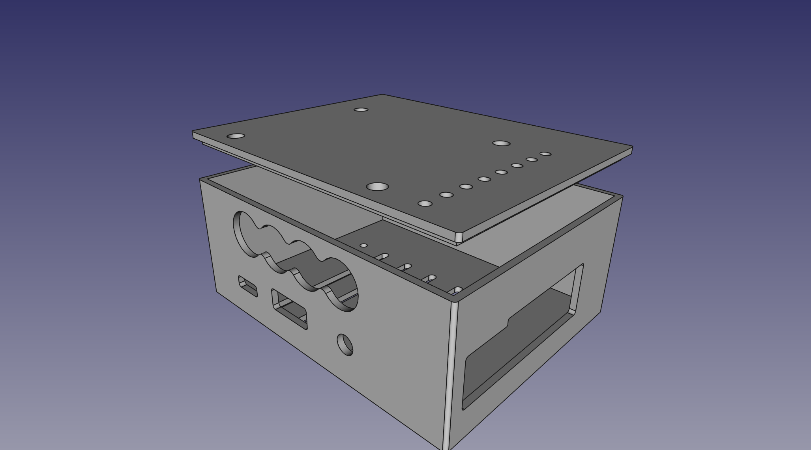
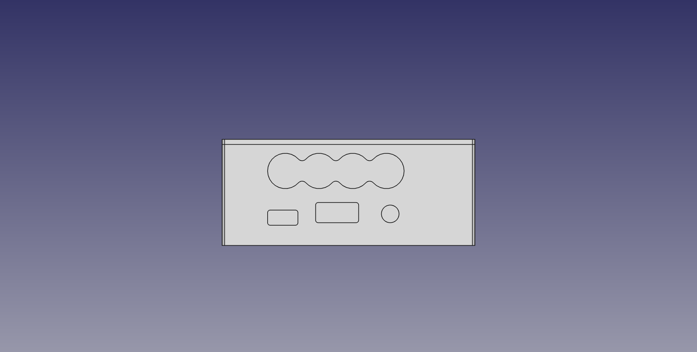
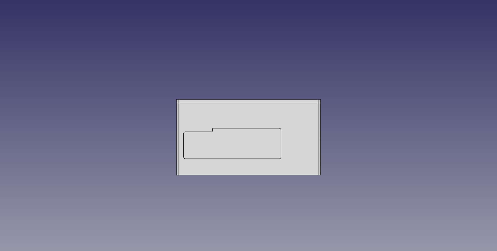
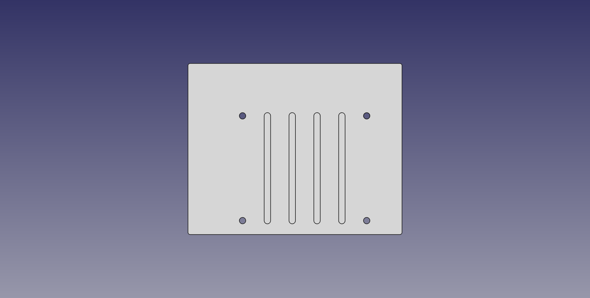
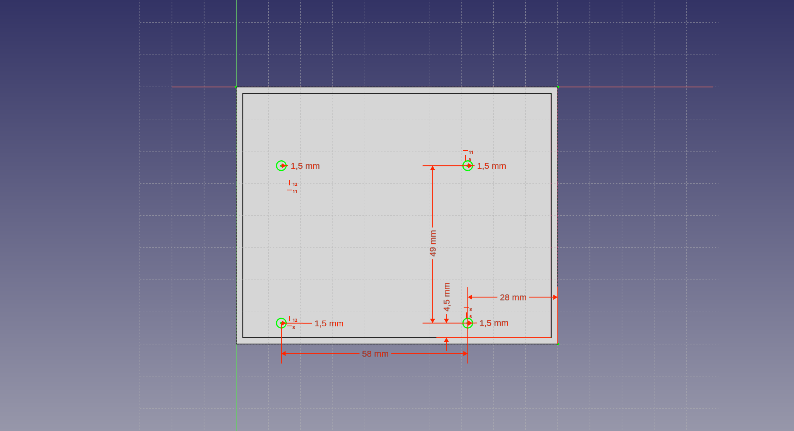

# FreeCAD model for Raspberry Pi 3B+

This is a Raspberry Pi 3B+ with a Allo Piano DAC.
3D-print-it!!

*Front*

*Right*

*Bottom*

*Mounting Holes*

# LICENSE

<dl>
 Dieses Werk ist lizenziert unter einer <a rel="license" href="http://creativecommons.org/licenses/by-nc/4.0/">Creative Commons Namensnennung-Nicht kommerziell 4.0 International Lizenz</a>.
</dl>

<dl>
 This work is licensed under a <a rel="license" href="http://creativecommons.org/licenses/by-nc/4.0/">Creative Commons Attribution-NonCommercial 4.0 International License</a>.
</dl>
